# Results

*(Generated by `python scripts/build_results.py` — rerun after new experiments to refresh. Full narrative: [docs/LOG.md](../docs/LOG.md).)*

**What this project does:** estimates structured posterior uncertainty (top covariance eigenpairs) directly from the Jacobian of a frozen point-cloud denoiser (Noise2Score3D, ICCV 2025) — no retraining, no sampling — adapting Manor & Michaeli (ICLR 2024) from images to 3D point clouds (ModelNet40).

## 1. Sensitivity vs noise level — in-range agreement with the σ² bound, with caveats

**Not a calibration sweep.** Noise2Score3D is an unconditioned score network with σ manually substituted into Tweedie's formula at query time — there is no per-σ verification that it is *the* MMSE denoiser at that σ (`covariance_kind = frozen_pyramid_sensitivity`, see `src/pcuq/denoisers.py`). σ²·J is a local sensitivity operator whose behavior we track across noise levels, not a proven posterior covariance being calibrated. Exact MMSE theory would bound its eigenvalues by σ²; how closely this frozen network's sensitivity tracks that bound in-range, and how it degrades out of range, is the actual result. Per σ (median top-eigval/σ² · negative eigvals · median convergence, over runs the symmetry gate accepted):

| σ | λ₀/σ² | negative eigvals | convergence | rejected by symmetry gate | trustworthy |
|---|---|---|---|---|---|
| 0.01 | 1.08 | 1 | 0.999 | 5/50 (10%) | 43/50 (86%) |
| 0.02 | 1.40 | 2 | 0.996 | 8/50 (16%) | 36/50 (72%) |
| 0.05 ⚠ beyond training range | -0.53 | 156 | 0.616 | 13/50 (26%) | 8/50 (16%) |

**`trustworthy`** (not rejected AND convergence ≥0.9 AND max Ritz residual ≤0.15, `pcuq.diagnostics.is_trustworthy`) is the number to quote — at σ=0.05 it's much lower than "not rejected" alone would suggest, because most accepted runs there are still poorly converged. A rejected run means the local Jacobian was too asymmetric for `top_eigenpairs` to call its eigenpairs a covariance at all — the pre-2026-09-16 pipeline never rejected anything, so these contributed unlabeled, possibly-meaningless numbers into earlier versions of this table (see docs/LOG.md 2026-09-16 entries). At the highest σ here, most of the *accepted* runs are also poorly converged — a bare median eigenvalue at that σ needs this context, not just the number.

## 2. The 3D-specific obstacle: graph rebuilds, and the fix

The KPConv denoiser rebuilds its voxel/neighbor graph every forward pass; finite differences across that rebuild measure O(1) discrete jumps, not the derivative. Freezing the anchor's graph (`freeze_graph`) differentiates the smooth branch:

Freezing helps, but freezing *everything* (topology and coarse-level point coordinates) turned out to be more than necessary: a weaker `graph_topology_frozen` variant (topology fixed, coarse coordinates recomputed from the perturbed input) is never rejected by the symmetry gate across a real-shape audit where the fully-frozen default was rejected on 2/3 shapes, and is now the default (`denoiser.graph_freeze_variant`, docs/LOG.md 2026-09-16).

## 3. Uncertainty structure lives in regions, not whole shapes

Whole-shape posteriors are near-isotropic (flat spectra). Restricting the operator to extremity patches (the reference paper's patch-mask move, in 3D) exposes real anisotropy:

Flat whole-shape spectra aren't just a cosmetic near-tie: a 2026-09-16 stability check re-noised 15 trustworthy whole-shape runs with a new seed (same points) and found the top eigenVALUE stable (median ratio 0.95) but the reported top-5 eigenVECTOR subspace essentially orthogonal to the original (median max principal angle 89.4°) — a direct consequence of the near-degenerate spectrum (median 16.6% top-to-5th spread) leaving the eigenbasis numerically ill-defined. **Whole-shape mode *directions* are not a reproducible property of the shape; only the top eigenvalue's magnitude is.** Point resampling was far gentler (eigenvalue shift ~8%). The natural follow-up question — are region-restricted modes more directionally stable, given their less-degenerate spectra? — was tested and answered **no**: median max subspace angle for regions under the identical new-seed check is **89.34°**, statistically the same as whole-shape's 89.4°. Region-restriction fixes eigenvalue spread; it does not fix direction reproducibility. **Every mode-direction figure below should be read as the mode for one specific noisy observation, not a reproducible geometric property of the shape** (docs/LOG.md, docs/PLAN.md).

## 4. The modes themselves

Best converged, PSD region runs (spread = top-to-last eigenvalue gap). Per exemplar: region modes, mode-0 direction arrows, mode-0 sweep x̂ ± t·√λ·v:

### table_0393_sigma0.02_r1  (spread 30%)

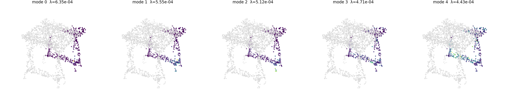
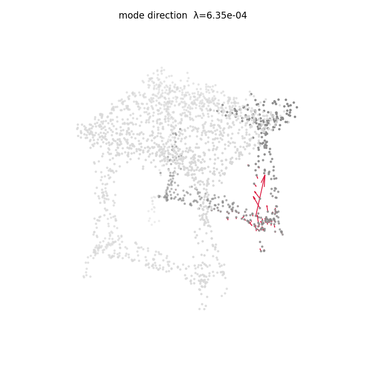
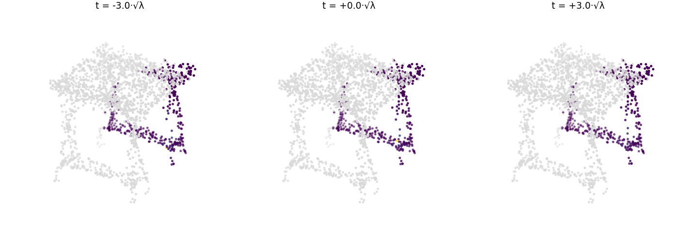

### lamp_0127_sigma0.02_r0  (spread 23%)

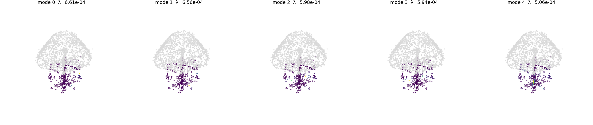
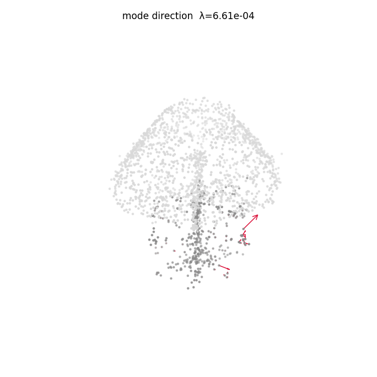
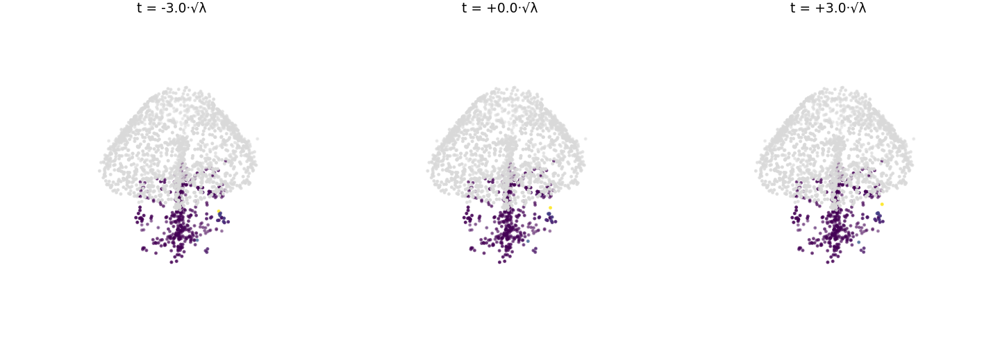

### airplane_0629_sigma0.02_r0  (spread 23%)

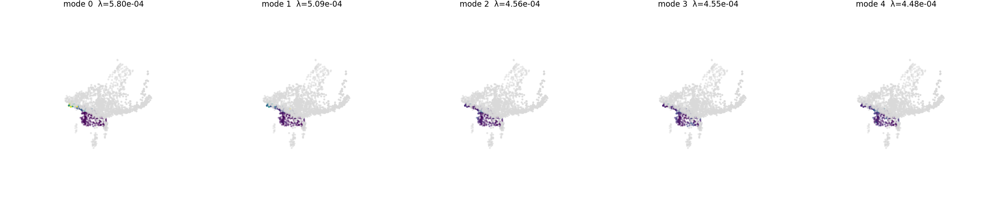
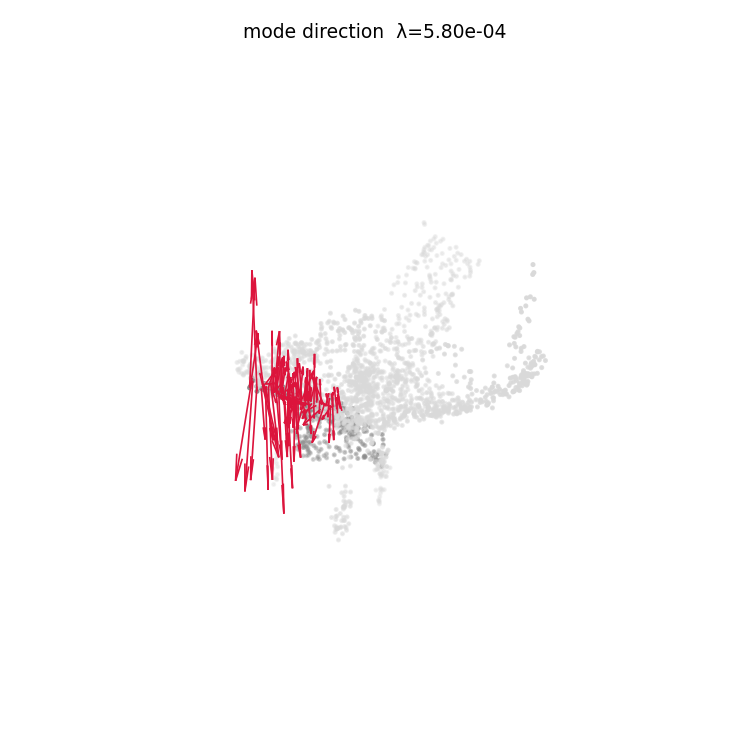
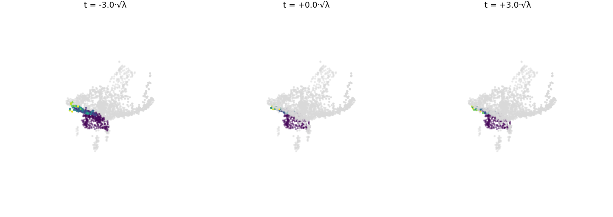

### chair_0891_sigma0.02_r0  (spread 19%)

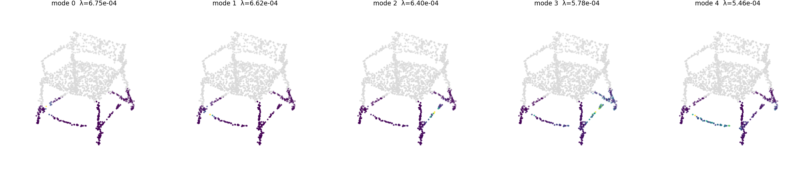
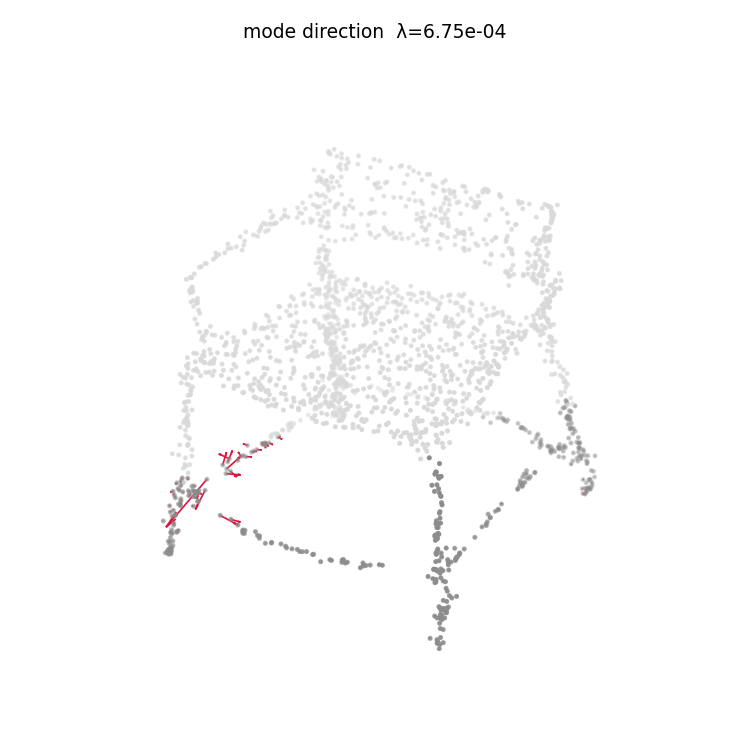
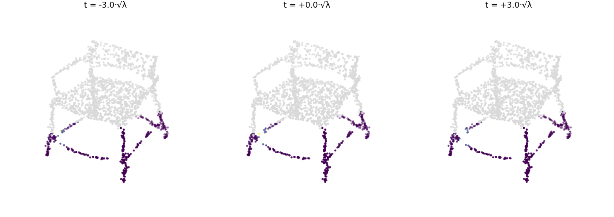

### guitar_0156_sigma0.02_r0  (spread 14%)

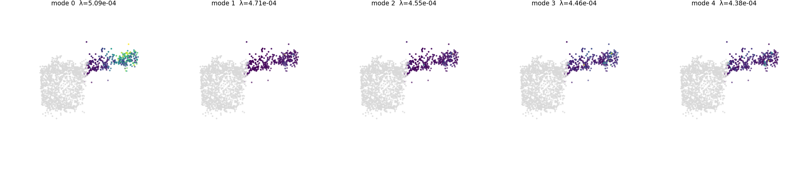
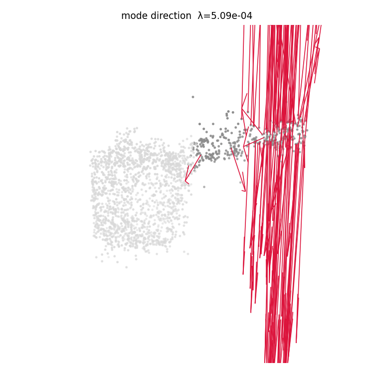
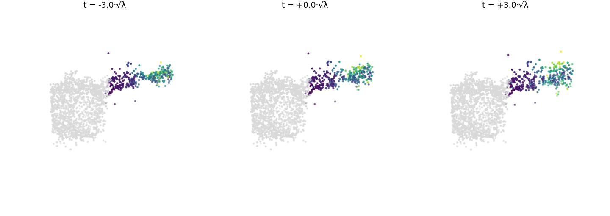
