# Results

*(Generated by `python scripts/build_results.py` — rerun after new experiments to refresh. Full narrative: [docs/LOG.md](../docs/LOG.md).)*

**What this project does:** estimates structured posterior uncertainty (top covariance eigenpairs) directly from the Jacobian of a frozen point-cloud denoiser (Noise2Score3D, ICCV 2025) — no retraining, no sampling — adapting Manor & Michaeli (ICLR 2024) from images to 3D point clouds (ModelNet40).

## 1. The method is calibrated — until the denoiser leaves its training range

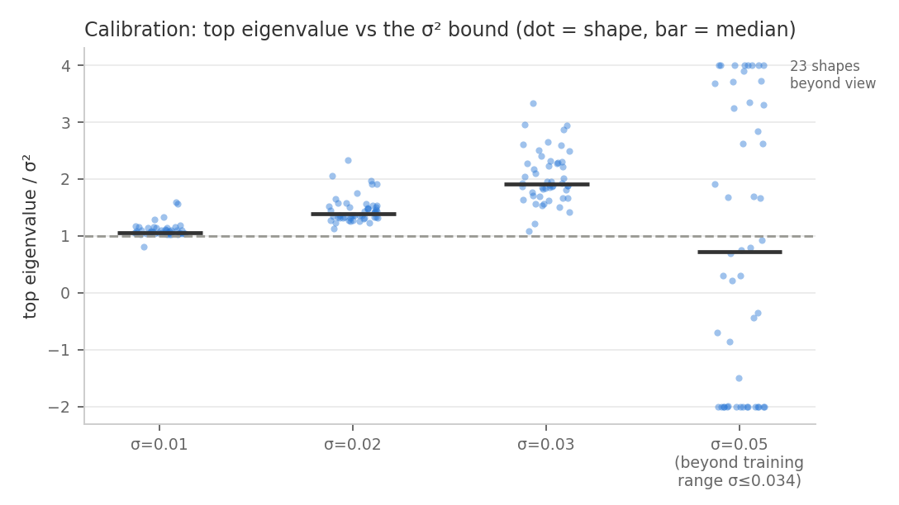

Exact MMSE theory bounds posterior eigenvalues by σ². Per σ (median top-eigval/σ² · negative eigvals · median convergence):

| σ | λ₀/σ² | negative eigvals | convergence |
|---|---|---|---|
| 0.01 | 1.06 | 0 | 0.999 |
| 0.02 | 1.39 | 2 | 0.996 |
| 0.03 | 1.91 | 19 | 0.934 |
| 0.05 ⚠ beyond training range | 0.72 | 191 | 0.408 |

## 2. The 3D-specific obstacle: graph rebuilds, and the fix

The KPConv denoiser rebuilds its voxel/neighbor graph every forward pass; finite differences across that rebuild measure O(1) discrete jumps, not the derivative. Freezing the anchor's graph (`freeze_graph`) differentiates the smooth branch:

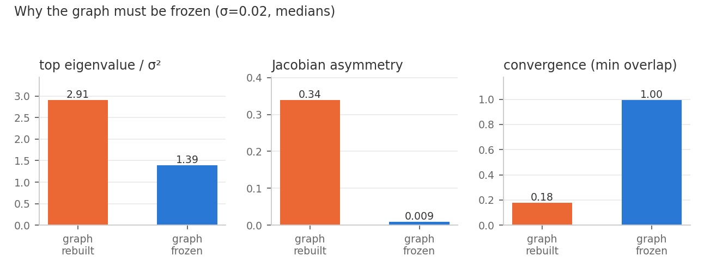

## 3. Uncertainty structure lives in regions, not whole shapes

Whole-shape posteriors are near-isotropic (flat spectra). Restricting the operator to extremity patches (the reference paper's patch-mask move, in 3D) exposes real anisotropy:

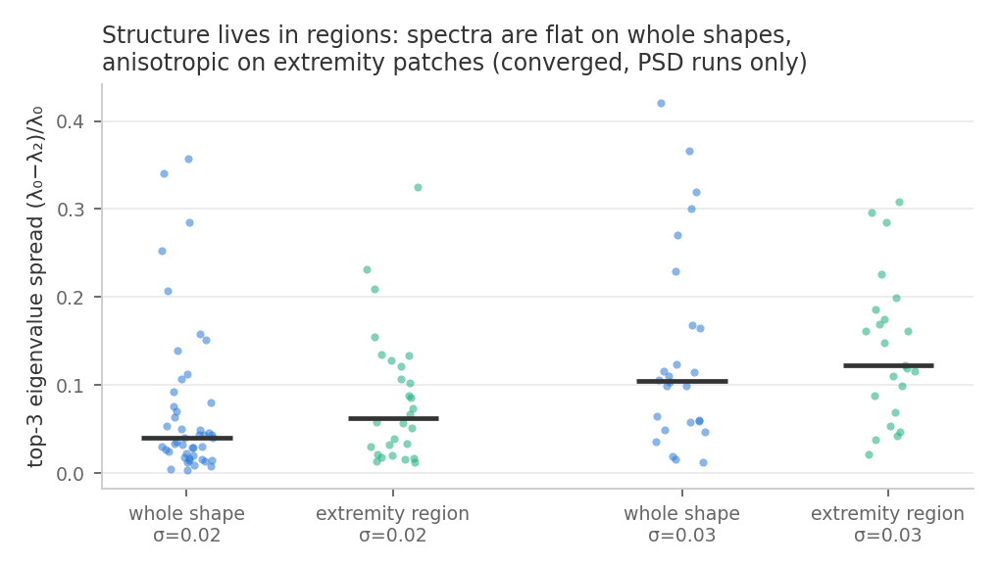

## 4. The modes themselves

Best converged, PSD region runs (spread = top-to-last eigenvalue gap). Per exemplar: region modes, mode-0 direction arrows, mode-0 sweep x̂ ± t·√λ·v:

### table_0395_sigma0.02_r1  (spread 33%)

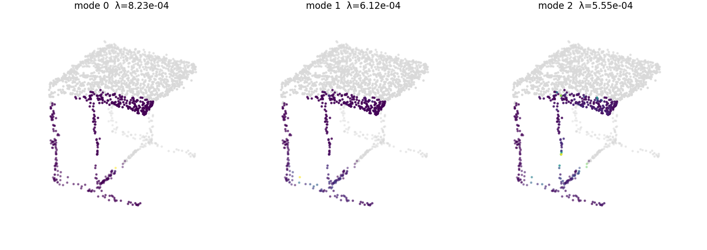
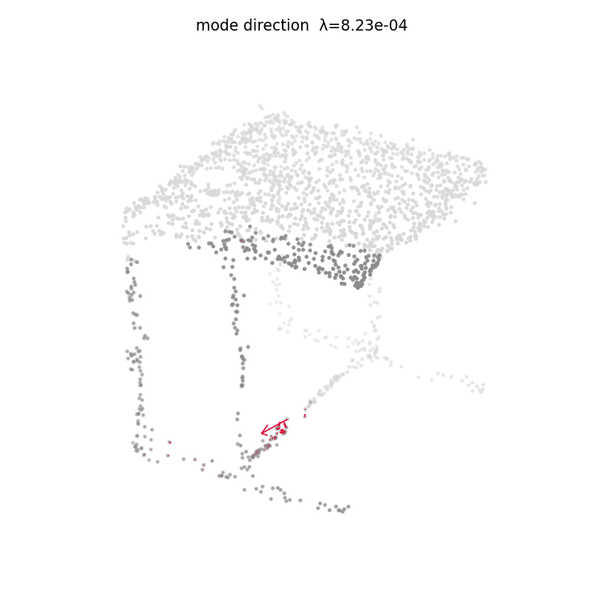
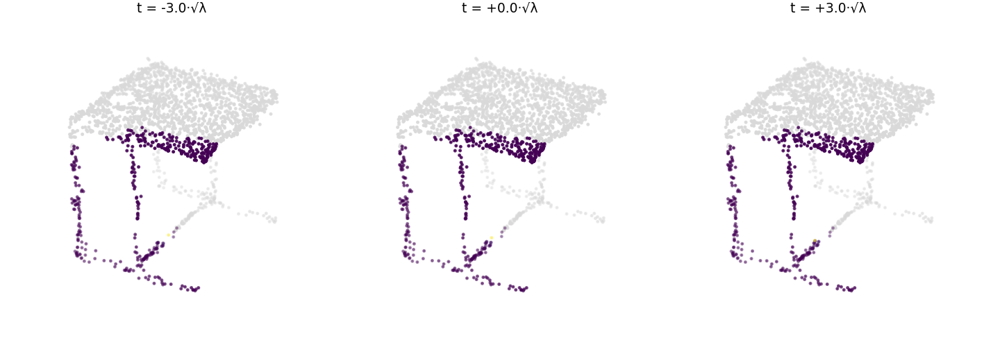

### guitar_0157_sigma0.03_r1  (spread 31%)

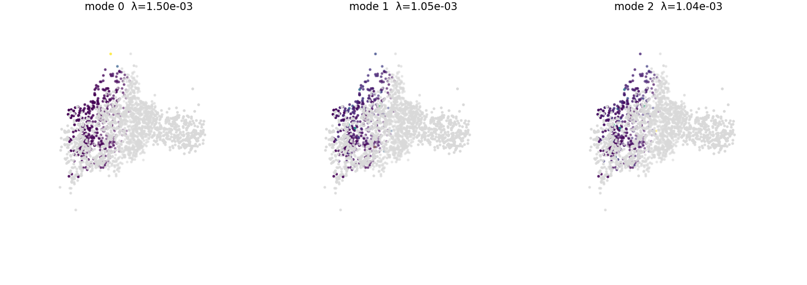
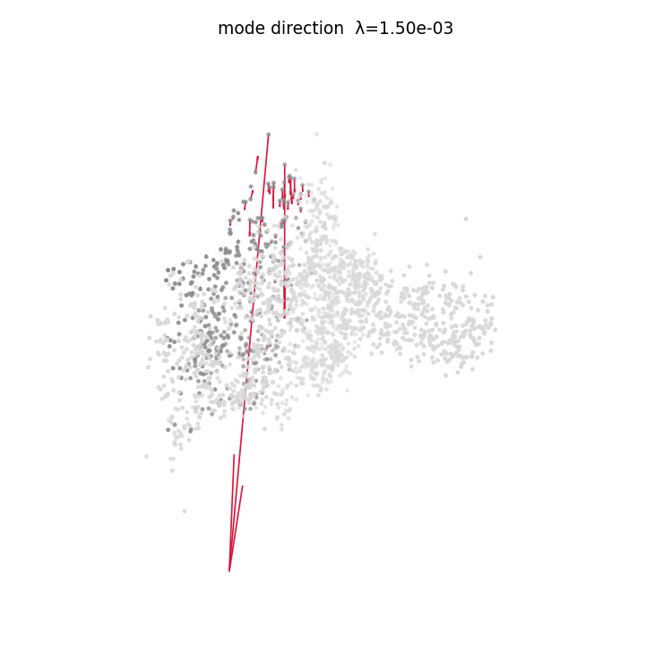
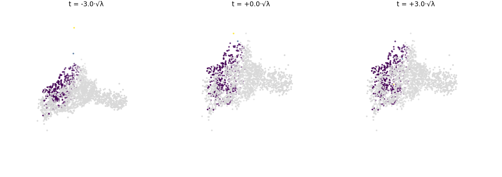

### chair_0891_sigma0.03_r0  (spread 30%)

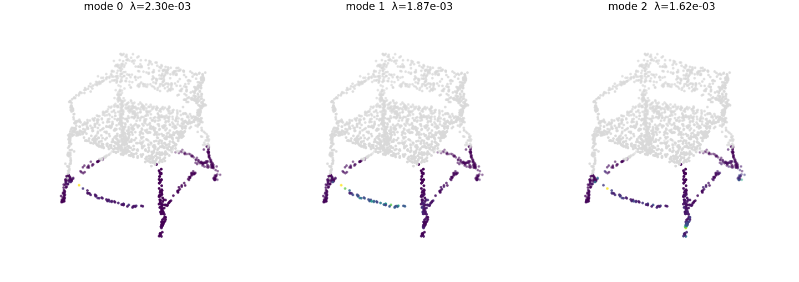
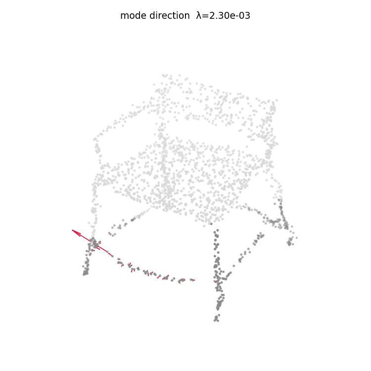
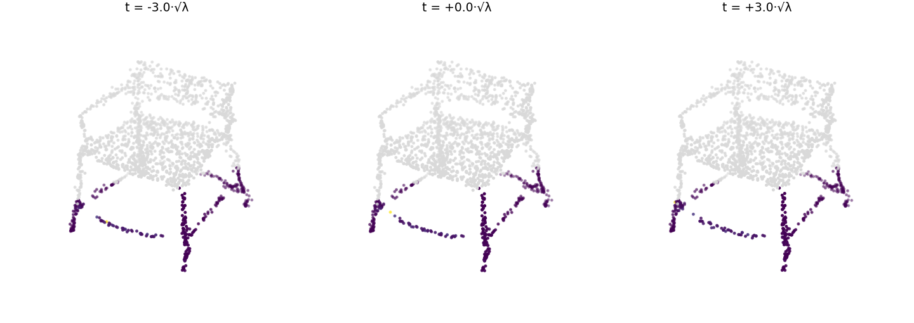

### table_0395_sigma0.03_r1  (spread 29%)

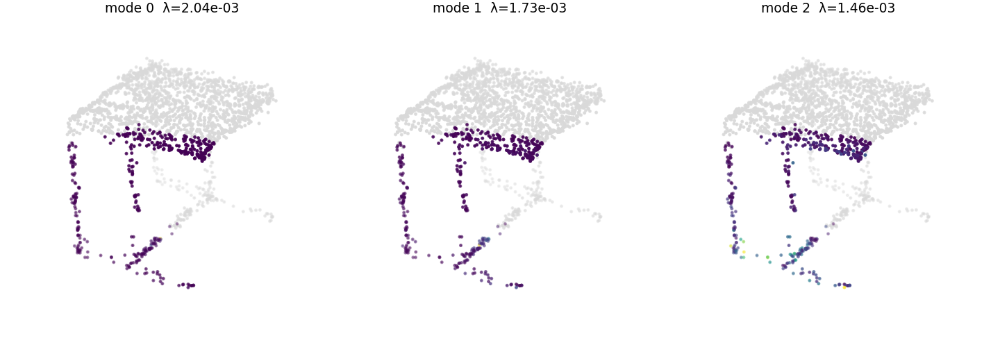
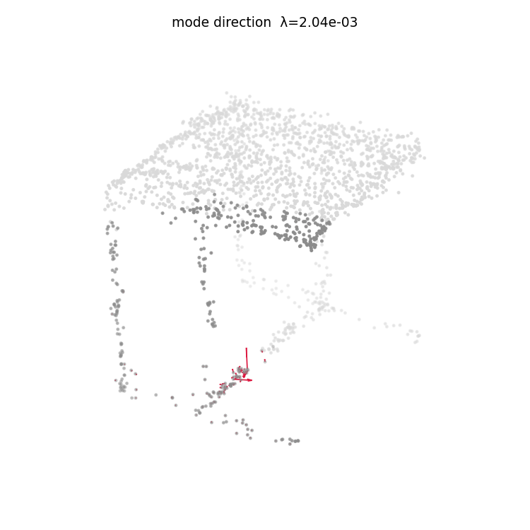
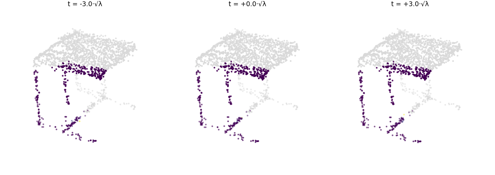

### lamp_0126_sigma0.02_r0  (spread 23%)

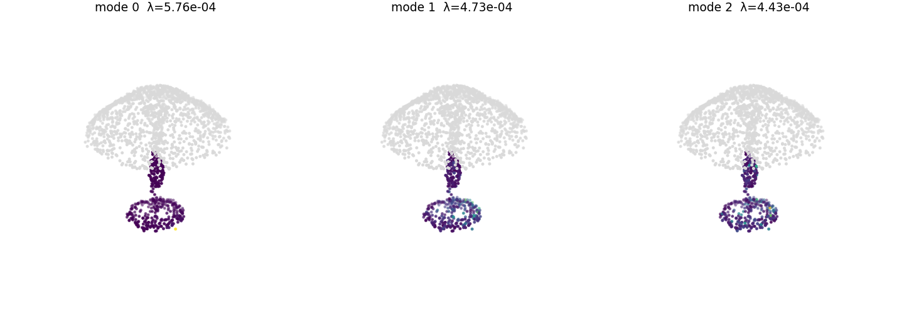
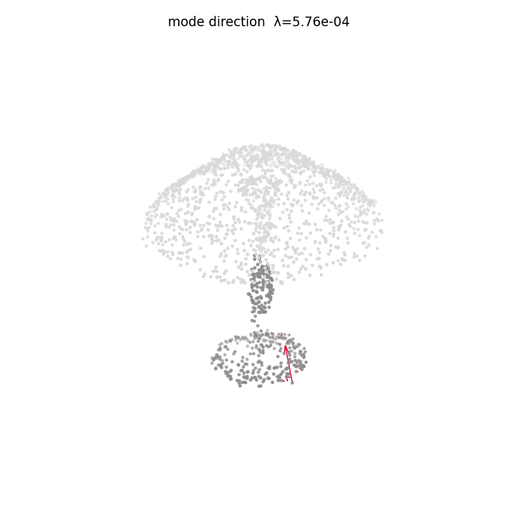
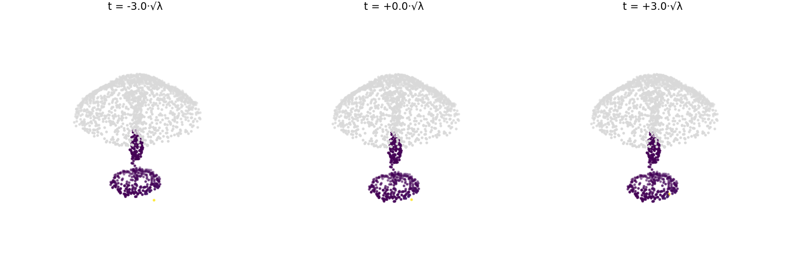

### airplane_0627_sigma0.02_r0  (spread 21%)

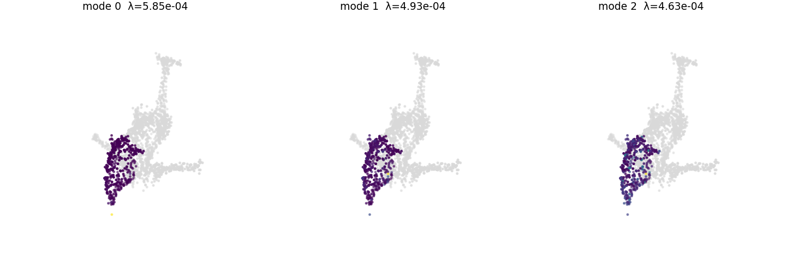
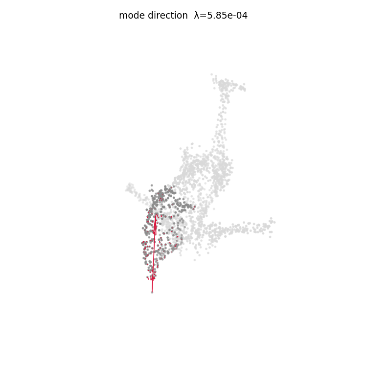
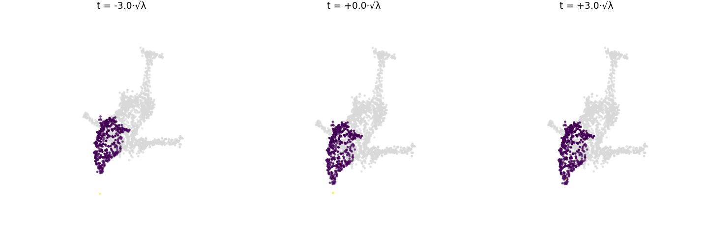
